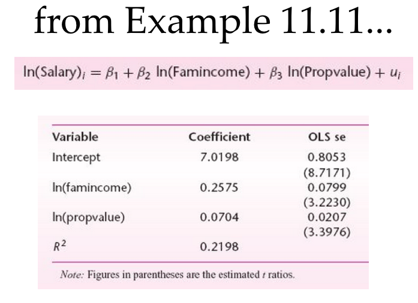

## 


## {.bigger}
```{r}
mydata = read.csv("Example11.11.csv")
lm1 = lm(log(salary) ~ log(income) + log(propvalue), data = mydata)
summary(lm1)$coefficient
```

##
```{r}
plot(lm1$fitted.values, lm1$residuals)
```

## Goldfeld - Quandt Test
```{r, warning=FALSE, message=FALSE}
require(lmtest)
gqtest(lm1)
```

##
```{r}
gqtest(lm1, order.by = lm1$fitted.values)
```

## Breusch - Pagan Test
```{r}
bptest(lm1)
```

## A Remedy: Heteroskedasticity Consistent Covariance Matrix...

## Obtaining the usual Variance-Covariance Matrix of Betahats...
```{r}
vcov(lm1)
# and the standard errors
sqrt(diag(vcov(lm1)))
```

## And the HCCM...
```{r}
require(car)
hccm(lm1) 
sqrt(diag(hccm(lm1)))
```

##
```{r}
?hccm
```

## And the HCCM se's
```{r}
sqrt(diag(hccm(lm1)))
sqrt(diag(hccm(lm1, type = "hc0")))
sqrt(diag(hccm(lm1, type = "hc1")))
```